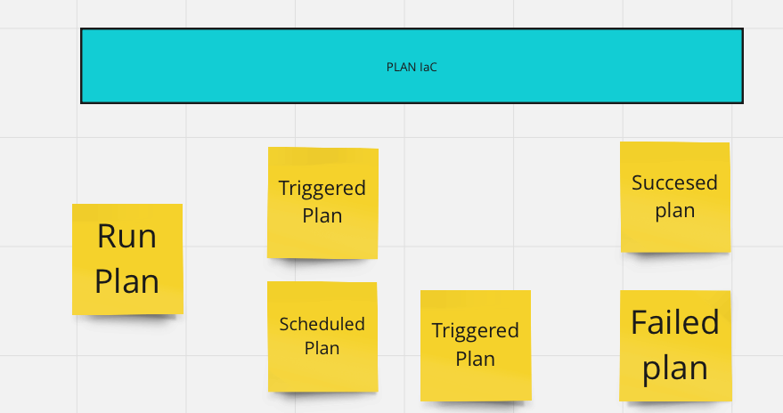

# Labraboard: The Intelligent IaC Management Platform


## About Labraboard

Labraboard is a state-aware Infrastructure as Code (IaC) platform specifically designed to manage Terraform configurations with ease and efficiency. Inspired by the Labrador, a versatile and intelligent working dog known for its roles as a guide, rescuer, and retriever, Labraboard embodies these qualities by becoming an indispensable tool in your infrastructure management toolkit.

## Key Features

* State Management: Efficiently handle Terraform states with support for InMemory storage, HTTP backend, PostgreSQL backend, and Redis queue.
* Lock Handling: Robust mechanisms to handle state locks, ensuring smooth and safe infrastructure updates.
* Custom Environment and Variables: Tailor your Terraform and OpenTofu environments with custom configurations for seamless deployments.
* Dynamic Backend Configuration: Automatically override backend configurations during plan or apply operations, simplifying the setup process.
* Project Operations: Manage projects with create, read, update, and delete functionalities, including the ability to specify Git references, set default values, and configure other essential parameters.
* Time Lease for State: Implement time-based leases to manage state longevity.
* User Configuration: Customize user settings and preferences.

## Why Labraboard?
Terraform is a powerful tool for managing infrastructure, but handling governance and surrounding processes can be challenging. Labraboard addresses these challenges, making it easier to run plans and apply infrastructure changes efficiently. With Labraboard, you can focus on building and deploying your infrastructure without worrying about the complexities of governance.

Labraboard - inspired by the intelligence and versatility of a Labrador, is here to be your guide in the world of infrastructure management.

## Starting point

Swagger docs has to be updated to reflect the new endpoints. 
It can be done by using command line `swag init -g ./cmd/api/main.go -o ./docs`

## Swagger Page
[Swagger API link](https://api.labraboard.dev)

Upps here should be demo video - no worry, I will be soon! - Now check the API on [https://api.labraboard.dev](https://api.labraboard.dev)

### Checking changes 
`git log --pretty=format:"%h%x09%an%x09%ad%x09%s"`

## RoadMap list
- [X] Reading plan
- [X] InMemory storage
- [X] Trigger run plan
- [X] Override backend
- [X] Use custom Env and variables on to terraform
- [X] Http Backend (Get Put)
- [X] Handle Locks on the state 
- [X] Handle Destroy
- [X] Add PostgreSQL as backend
- [X] Redis queue
- [X] Project CRUD
- [x] Add reference to git sha in aggregate and relate with plans
- [x] Add mapping to decouple mapping between aggregates and repository
- [X] Add and remove env variables
- [X] Add and remove  variables
- [X] Fix handling returning changes from plan
- [X] Add unit testing of aggregates
- [X] ~~Bug fixing e2e testing~~ (manually)
- [X] Path for parameters in git folder
- [X] Create handlers cmd
- [X] Time Lease for the state
- [X] Refactor and move to use interfaces in handlers
- [X] Implement Logging
  - [X] Logger and move init code to init function
  - [X] Integrate logger with gin - use middleware for recordId, in future userId
  - [X] Propagate context values between loggers
  - [X] Replace all print to logger
  - [X] Add every method ctx to enrich logger
  - [X] Integrate handlers to use logger
- [X] Handle scheduled plan in TerraformPlanner
- [X] Run plan using http backend 
- [ ] Access Token for Backend http
- [ ] Clean solution to be more DDD
- [ ] Create Plan changes during run, what was happened during the time
- [X] Apply Mechanism to handle the state
  - [X] Apply based on the Plan
  - [X] Save outputs as deployment, handle errors
- [ ] Backup before apply using ApplyOptions.Backup
- [ ] Implement retries on apply
- [ ] Correlate Project, Deployment, Plans
- [ ] Integrate with the Git
- [ ] Handle other version than version 4.0 of tf 
- [ ] Handle multiple version of tf and tofu
- [ ] Policies and run on pre/post plan/apply
- [ ] Authenticate
- [ ] User configuration
- [ ] Add a web interface
- [ ] Encryption at rest

### Architecture 
#### Event Storming 
[Labraboard Event storming](https://miro.com/app/board/uXjVKHzpuQ4=/?share_link_id=741994614357)



### Http Backend
Solution uses own delivered http backend where state is kept. During running plan or apply the backend configuration is 
added automatically by overriding the backend. 

#### Example of using own http Backend
please use your project id. Application use it identify terraform state.
```hcl
terraform {
  backend "http" {
    address = "http://localhost:8080/api/v1/state/terraform/bee3cf56-ecd1-4434-8e18-02b0ae2950cc"
    lock_address = "http://localhost:8080/api/v1/state/terraform/bee3cf56-ecd1-4434-8e18-02b0ae2950cc/lock"
    unlock_address = "http://localhost:8080/api/v1/state/terraform/bee3cf56-ecd1-4434-8e18-02b0ae2950cc/lock"
  }
}
```

## Links

1. https://www.squash.io/optimizing-gin-in-golang-project-structuring-error-handling-and-testing/
2. https://github.com/swaggo/gin-swagger
3. https://github.com/eddycjy/go-gin-example
4. https://github.com/derekahn/ultimate-go/blob/master/language/interfaces/main.go
5. https://github.com/percybolmer/ddd-go
6. https://velocity.tech/blog/build-a-microservice-based-application-in-golang-with-gin-redis-and-mongodb-and-deploy-it-in-k8s
7. https://www.ompluscator.com/article/golang/practical-ddd-domain-repository/?source=post_page-----d308c9d79ba7--------------------------------

## Disclaimer

Please note that this project is currently under active development and is not considered production-ready. We are continuously working to improve and stabilize its features, but it does not yet meet all the requirements for production use.
